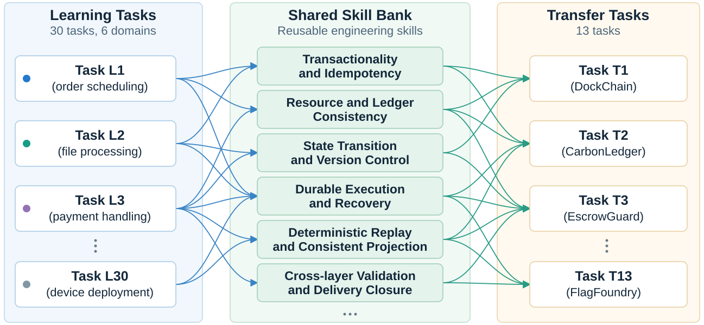
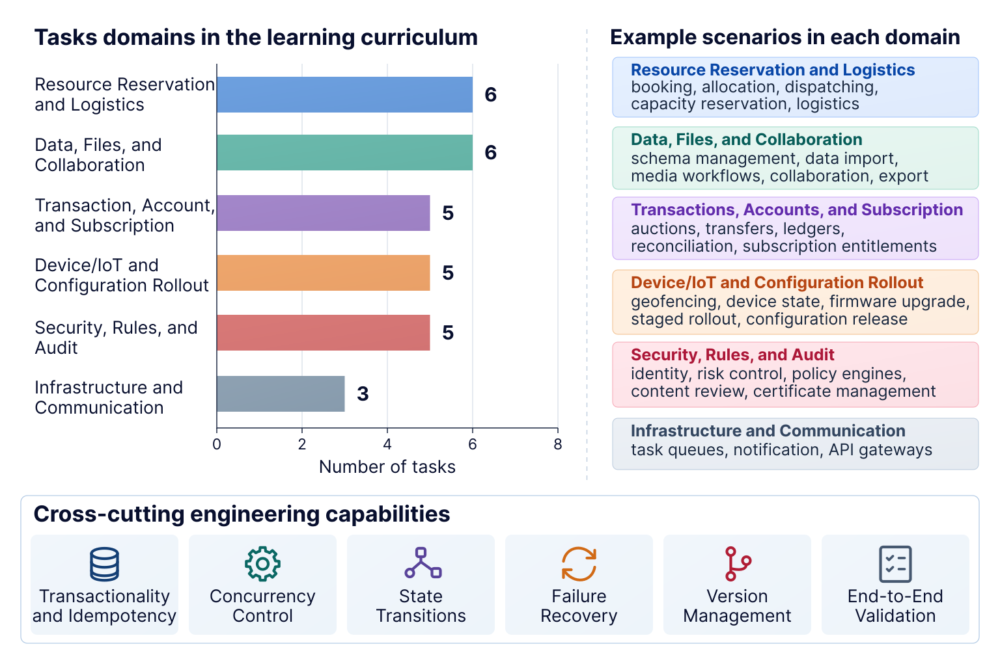

# EngramBench

<p align="left">
  
</p>

**Long-horizon software engineering, from historical experience to transferable skills.**

EngramBench evaluates whether experience from past projects helps a coding agent build a different, complete software system. Tasks go beyond isolated functions: agents must connect public APIs, persistent state, background workers, recovery, OpenAPI, and browser interfaces under explicit business constraints.

The benchmark contains **30 Learning tasks** and **13 Transfer tasks**. This is the standalone, contract-first **V2** implementation, formerly developed as Frontal Benchmark V2.

**Design principle: capability overlap without solution overlap.** Learning and Transfer projects exercise related engineering mechanisms in different business settings. Skill banks should carry reusable procedures—not project-specific solutions or test answers—between them.

[Task catalog](TASKS.md) · [Task specification](docs/task-package-v2.zh-CN.md) · [Environment setup](environments/README.md) · [Evaluation](docs/EVALUATION.md) · [MIT license](LICENSE)



*Illustrative capability relationships—not direct reuse of project-specific code. Click the figure to view it at full size.*

## What is included

- **43 task packages:** requirements, frozen plans, simulated-user scenarios, fixed interface scaffolds, public checks, and evaluator fixtures.
- **A conversation harness:** a Coding Agent implements the project; a model-based User Agent requests progress, review, and delivery.
- **Contract-first execution:** routes, request/response schemas, startup commands, seed formats, and snapshot interfaces are supplied. The agent implements the business logic behind them.
- **Independent evaluation:** frozen deliveries are tested in separate containers for functional correctness, concurrency, recovery, UI behavior, and performance.
- **Reproducibility records:** package and plan digests, conversation state, frozen submissions, and per-case evidence.

The integrated launcher uses **Codex** as the Coding Agent and an OpenAI-compatible chat endpoint for the User Agent. Driver interfaces are separated from the harness; this is not a claim that every agent framework has been end-to-end validated.

### Release status

Evaluator code and fixtures are public. **Hidden** means *not supplied to the Coding Agent during development*, not secret from repository readers. Do not give an evaluated agent this whole repository: use the launcher or export its workspace with `prepare:task`.

The included evaluator records are **not formally certified**: 41 are `pending_live_validation`; IncidentRelay and PermitForge remain `pending_alignment`. Development and explicit author-validation are supported; formal evaluation requires digest-bound certification. Static checks and framework tests do **not** certify all business cases. This publication does not rewrite existing experimental results. See [Release scope](docs/OPEN_SOURCE_RELEASE.md).

## Quick start

Requirements: **Node.js 24+** and npm on the host. Docker is needed for agent execution and isolated evaluation, but not for the installation checks below.

```sh
git clone https://github.com/Virgil-Tan/EngramBench.git
cd EngramBench
npm ci
npm test
npm run check
```

Export a fresh task workspace without evaluator code or fixtures:

```sh
npm run prepare:task -- --task capacitylease --output ../capacitylease-workspace
cd ../capacitylease-workspace
npm ci
npm run check:contract-source
```

Read that workspace's `README.md` and `FROZEN_PLAN.md`. Business operations are deliberately unimplemented. A passing schema/source check is not a solved task.

### Run an agent

1. Follow [Environment setup](environments/README.md) to build native evaluator and agent images.
2. Copy `profiles/baseline.example.json` to `profiles/my-run.json`.
3. Set a unique run ID, task IDs, your model identifiers, an absolute authentication-file path, and the pinned agent image ID. Set User Agent credentials using the environment-variable names in the profile; never commit credentials.
4. Keep `purpose: "development"` and `evolution: false` for the included uncertified evaluator packages.
5. Run:

```sh
npm run run -- profiles/my-run.json
```

Development follows the frozen plan, runs the author-owned public contract gate, and freezes the delivery at `awaiting_evaluation`. It does not silently award a hidden-test score. Use [Evaluation](docs/EVALUATION.md) to evaluate the frozen delivery separately.

Artifacts are saved under `runs/<runId>/`: experiment identity, per-project workspace, private harness state, and frozen submission. Use different run IDs for independent repetitions. Do not regenerate packages inside a running experiment.

## Experimental protocol

```text
Learning projects → execution histories → skill distillation → frozen skill bank
                                                                  ↓
Transfer README + fixed scaffold + Frozen Plan → User ↔ Coding Agent
                                                                  ↓
                                           public gate → frozen delivery → evaluator
```

The **README and public contract define the task**. The Scenario governs interaction and progression; it is not an alternative feature checklist. The Frozen Plan is prepared before execution and shared across comparison arms.

Freeze the skill bank before Transfer execution. Do not update it using Transfer feedback within the experiment. Match task versions, plans, models, environments, evaluation cases, and seeds across arms.

| Arm | Agent access | Additional configuration |
| --- | --- | --- |
| `baseline` | No supplied skills or Runtime Guide | `profiles/baseline.example.json` |
| `native` | A fixed bank installed as native agent skills | `nativeSkillsRoot`; `profiles/native.example.json` |
| `guide` | Optional task-scoped Runtime Guide integration | External MemoraX installation and a dedicated `memoraxHomeSeed` |

Baseline and native-skills runs **do not require MemoraX**. The repository includes integration code, not the internal M1–M6 implementation or private skill banks. Distillation methods can use the same exported histories and downstream execution protocol.

## Tasks

[`learning-tasks.json`](learning-tasks.json) and [`transfer-tasks.json`](transfer-tasks.json) are the ordered inventories. [TASKS.md](TASKS.md) describes all 43 projects, intended transferable mechanisms, and engineering challenges.



| Transfer task | Setting | Main challenge | Group |
| --- | --- | --- | --- |
| MeterSettle | Usage-based billing | Watermarks, late events, revisions, monetary consistency | Standard |
| DockChain | Port logistics | Berth conflicts, custody handoffs, scheduling | Standard |
| IncidentRelay | Incident operations | Escalation, acknowledgement, notification recovery | Standard |
| FlagFoundry | Feature management | Immutable revisions, deterministic rollout, aggregation | Standard |
| CarbonLedger | Carbon credits | Conservation, lineage, immutable certificates | Standard |
| ParcelFlow | Order fulfillment | Atomic allocation, cancellation/shipping races | Standard |
| ColdChainControl | Cold-chain IoT | Signed telemetry, projections, reliable notifications | Superhard |
| CreatorRightsExchange | Media rights | Uploads, payments, royalties, cross-store consistency | Superhard |
| AccessSentinel | Privileged access | Trust, risk, approvals, revocation, audit | Superhard |
| CommerceCommand | Omnichannel commerce | Quotes, stock, payments, fulfillment, ledger | Superhard |
| EscrowGuard | Escrow settlement | Release/refund/dispute races and allocation | Mid-hard |
| PermitForge | Approval workflows | Frozen quorums, reviewer leases, deadlines | Mid-hard |
| CapacityLease | Capacity reservations | Time windows, promotion, atomic multi-pool allocation | Mid-hard |

Difficulty groups are author-defined, not measured completion-time guarantees.

## Evaluation and reporting

| Dimension | What it tests |
| --- | --- |
| A | Requirements and public interface coverage |
| B | Data correctness, idempotency, and concurrency |
| C | Workers, recovery, and persistence |
| D | OpenAPI, UI, and cross-layer verification |
| E | Compatibility, performance, and operability |

For a case-level pass fraction, report **confirmed passed cases / all applicable, non-excluded scheduled cases**. Unresolved or unreached applicable cases contribute no passes. Report incomplete coverage and evaluator/infrastructure failures separately; do not silently drop them or relabel them as agent failures.

The evaluator also implements weighted scores, hard-cap rules, and an all-cases-pass verdict. These are **different metrics** from the unweighted case fraction. Author-validation returns `formalEligible: false` and null formal scores. Read [Evaluation](docs/EVALUATION.md) before interpreting results.

For cost comparisons, preserve model settings, completed turns, active execution time, and input/output usage. Cached input is part of input; reasoning tokens are part of output. Do not add them again or sum cumulative session counters as per-call usage.

## Isolation and limitations

- Development containers receive task workspaces, not evaluator trees. Evaluation uses frozen submissions and author-owned checks.
- Case execution uses disposable databases and container/network isolation. The default bridge network is **not** a blanket network-denial policy.
- The submitted application and trusted evaluation process share a filesystem inside the evaluator container. This is **not a hardened sandbox for malicious submissions**.
- Published fixtures support reproducibility, but cannot guarantee freedom from contamination or deliberate test-answer hardcoding. Report prior test exposure.
- Preserved legacy source copies support provenance and regeneration; they are not a second supported execution route.

## Repository layout

```text
task-packages/v2/       Generated runnable packages
contracts/             Authoritative public interfaces
evaluators/            Authoritative cases, fixtures, release records
templates/             Shared contract-first scaffold
src/, scripts/         Harness, drivers, runtime, CLI tools
environments/, docker/ Container recipes and environment profiles
profiles/              Credential-free examples
test/                  Framework and evaluator regression tests
provenance/            Original-source inventories and hashes
tasks/, experiments/, task-packages/legacy/, task-packages/imported-contract-first/
                       Preserved authoring inputs needed by V2
docs/                  Protocol and author-maintenance documentation
```

Some filenames, `FRONTAL_*` environment variables, and serialized protocol identifiers retain their historical names for compatibility. The project name and public entry point are **EngramBench**.

## Contributing

Edit author sources, not generated packages. Run `npm run build:tasks` for task/scaffold changes or `npm run build:evaluators` for evaluator-only repairs; then run `npm test` and `npm run check`. Never overwrite experiment workspaces or silently change a result's evaluator version.

When filing an issue, include the task ID, package revision, environment, reproducible input, and expected public-contract behavior. Do not attach account credentials or private conversations. Interface clarification must preserve business requirements; submission-specific adapters are not part of the protocol.

## License

Code, task specifications, and evaluator fixtures are released under the [MIT License](LICENSE). Third-party dependencies and container images retain their own licenses.
